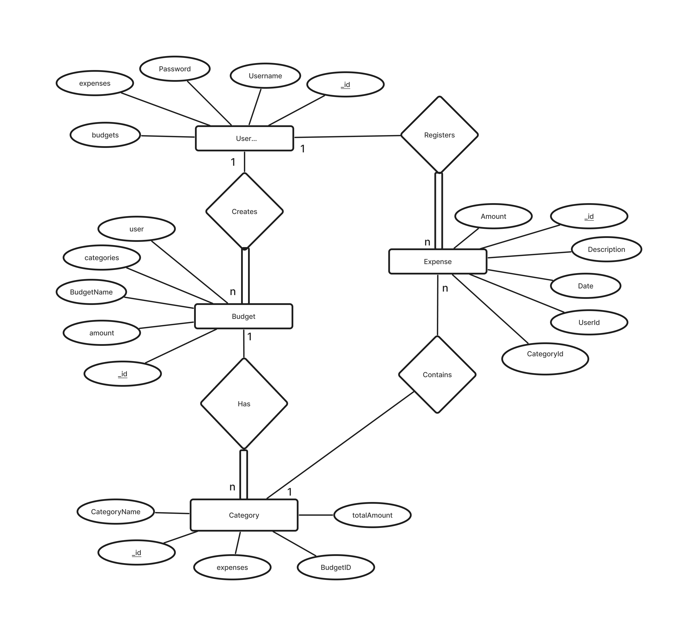
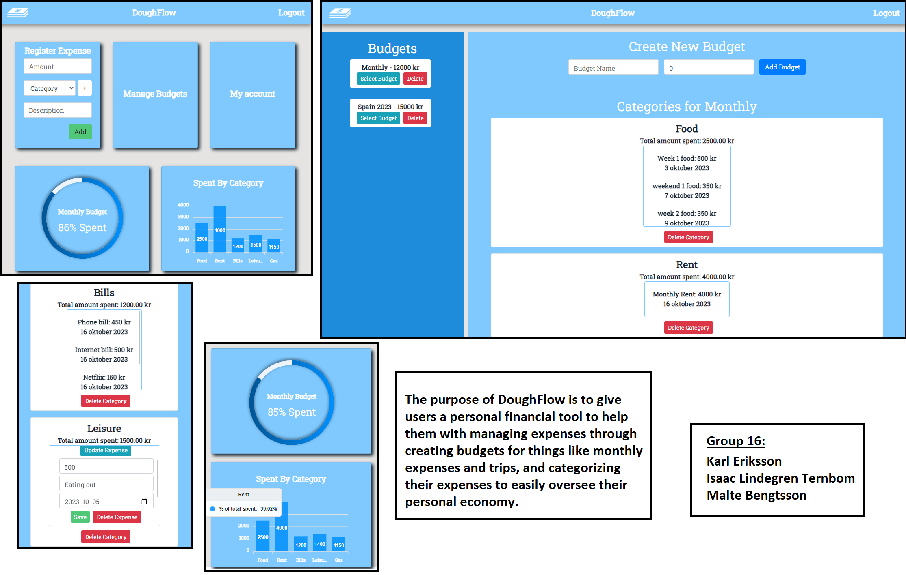

## Project Structure

| File        | Purpose           | What you do?  |
| ------------- | ------------- | ----- |
| `server/` | Backend server code | Backend server using Node.js/Express
| `client/` | Frontend client code | Client using Vue 2|
| [client/README.md](client/README.md) | Everything about the client | **READ ME** carefully! |
| [docs/LOCAL_DEPLOYMENT.md](docs/LOCAL_DEPLOYMENT.md) | Local production deployment | Deploy app locally in production mode |

## Getting started

# Clone repository
git clone git@github.com:IsaacLT/DoughFlow-Dashboard.git

# Change into the directory
cd group-16-web

# Setup backend
cd server && npm install
npm run dev

# Setup frontend
cd client && npm install
npm run serve
```

## System Definition (MS0)

### Purpose

Our system is a financial management tool. Users can log individual expenses, upload files of their monthly expenses from their bank, and add these to budgets the users create. The user will be able to categorize their expenses both in predefined categories and custom made ones. There will be data visualization for the users spending.

### Pages

* **Login page:** page for user to log in to their created account, alternatively for creating a new accouunt.

* **Dashboard page:** Once the user has signed in to thier account, the dashboard will be displayed. The dashboard is used for navigating through the web application and will display your current budget and expenses. Additionally the user can register an expence directly through the dashboard.

* **Budget Management page:** The budget management page lets the user select between different budgets and see details on the economic status of each category connected to that specific budget. The user can also create new budgets from this page. 

### Entity-Relationship (ER) Diagram



## Finnished Website


